1.31 7+8；done

* 读这本书的感受是，很多目前对程序的底层和执行细节的理解都有问题，不够细致，不够底层，不够深入。这次借由读这本书，好好深刻地理解一下程序基础的部分，底层执行步骤的细节理解越准确且部分深入，对未来导向的理解就越正面，顺势，越能轻松起飞。（基础决定未来）
* 语言是很有力量的，所以要彻底改写大量过去不对的想法。
* 语言是很有力量的，所以要大量吸收正确的经典的描述/描绘方式。
* 发现的一个问题是：由于读的都是以前懂的对象，所以很容易根据惯性理解错读语句。
  * 解决方案是：仔细重读，反复重读，逼自己一字一句读。
  * 制作PPT时反复雕琢自己理解的是否准确，反复读上三遍以上。（每一遍多要细，确保吸收到能背得出来才行）
  * （好书的语言是很考究的，so好的表达方式，要大量地记）
* 细节大量记不住怎么办？
  * 解决方法是：制作精简版本的ppt，必要时增加针对自己的笔记（以备以后复习及授课，脉络逻辑都要清晰且具备）。
  * 如何制作好的PPT：反复雕琢打磨，直至完全系统地/理论丰满地全部把这一整棵树以及其开枝散叶的地方，全部细节，完全移植到心里去。再幻化为授课PPT。（知识越多，讲得越不枯燥，旁征博引，要积累）
  * 至少一边做题，一边反复翻看前面的内容，确保：句子一字一句完全读对且背出——改写原说话方式，保证正确读取→保证已理解正确→保证能真确准确细致和盘托出，来龙去脉，包括细节的语言表达，铺陈）。

2.1 9+10；done

* 应该及时梳理一个竖版的笔记。左右翻页对记忆和脉络不友好。也不容易调出自己需要记住的东西。

2.3 11+12; done

```c
#include <stdio.h>

int main() {
    int a[10][5] = {0,1,2,3,4,5,6,7,8,9,
                    10,11,12,13,14,15,16,17,18,19,
                    20,21,22,23,24,25,26,27,28,29,30};
    int (*p)[5] = a;
    int b[5] = {0,1,2,3,4};
    int *q = &b[0];
    int *i = &b; //Incompatible pointer types initializing 'int *' with an expression of type 'int (*)[5]'
    printf("%d\n",q[3]);
    printf("%d",(*p)[1]);
    return 0;
}
```

指针变量定义：

```c 
/**************
 * 指向一个变量 *
 **************/
int *p = &变量; //变量可以未赋值。

/**************
 *  指针和数组  *
 **************/
//1. 可以指向一个数组元素
int *q = &a[1]; //指针q指向数组元素
//2. 可以指向一个一维数组a
int *p = a; //p存放了a第一个元素的地址
p == &a[0];
p+i == &a[i];
*(p+i)==a[i];
//数组int b[10]作为函数参数，即数组的第一个元素的指针被传入，形参int b[]：

```

C语言的类型定义：

```c
int 变量名 —— int型变量。
int 变量名[长度] —— int型数组。
int *指针名 —— 指向int型对象的指针。
int (*指针名)[长度] —— 指向长度为[]的数组的指针 —— 类型为：int (*)[长度]

```

* C语言的变量，是基本类型在前声明其数据类型，变量名的周围各种标志突出了这个变量的特色——数组[]、*指针、变量。

* C语言中，变量未经初始化是很危险的，它可能会存有残存的值。


C语言与数组：

* 数组名 = 指第一个元素的指针
* **元素address = &A[i] 或 A+i**
* **元素value = A[i] 或 *(A+i)**

```c
void mian(){
	int A[] = {2,4,5,8,1};
  printf("%d\n",A);      //A表示一个指针，who指向数组的第一个元素
  printf("%d\n",&A[0]);  //地址
  printf("%d\n",A[0]);   //值: *(A+i)
  printf("%d\n",*A);     //值: 
  printf("%d\n",&A);     //地址: 
}
//-272632752 地址
//-272632752 地址
//2
//2
//-272632752
```


二维数组和指针：

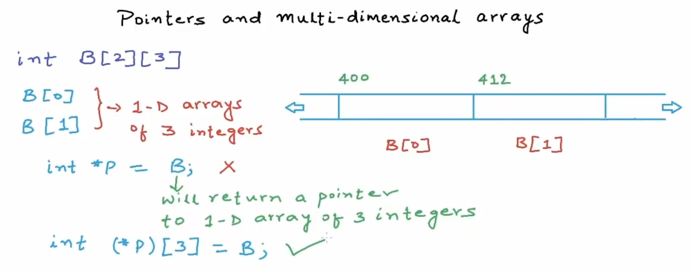

* B表示一个指向一维数组（包含三个整数的）指针。
* 声明指针：int (*p)[3]
* 指针的类型：int (*)[3]

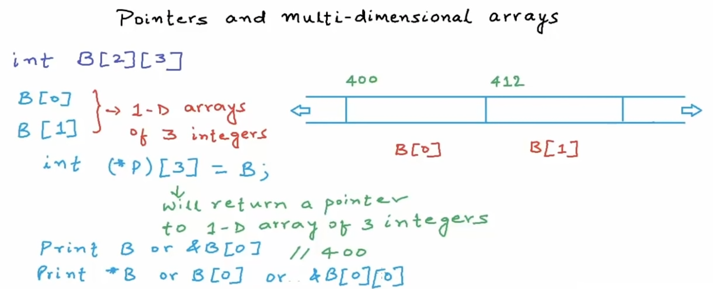

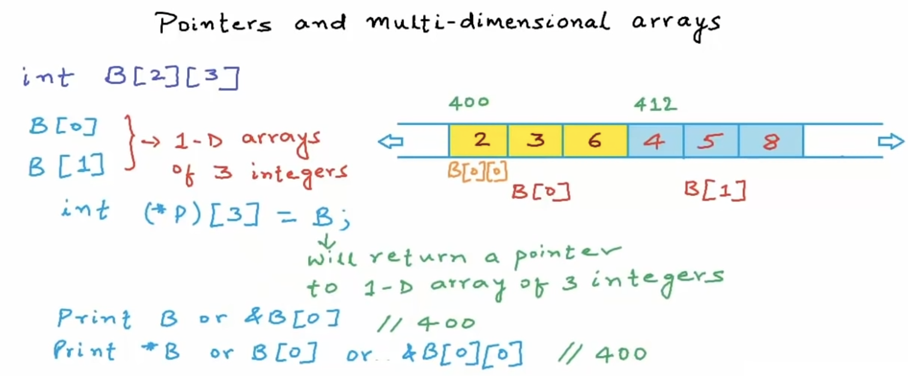

* B表示指向第一个元素的指针，其指针的值存为里面第一个元素的地址。&B[0]
* *B表示第一个元素，它又是一个数组的名字，所以也是指针，是其第一个元素的地址。`&B[0][0]`, 

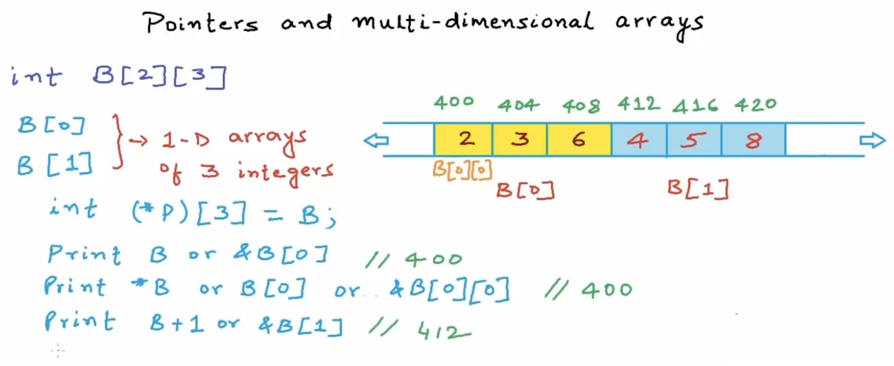

* B+1 //是一个指针，指向一个包含3整数的一维数组。所以B+1是&B[1]，即B[1]的地址。
  * 400+size of 1-D array of 3 integers, 所以是400+12=412。

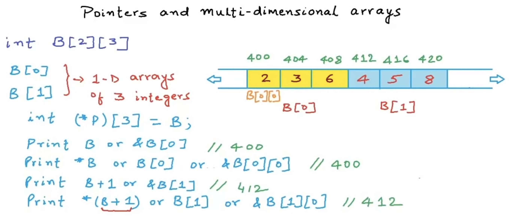

* `*B 、 B[0] 、 &B[0][0]` 和 `*(B+1) 、B[1] 、 &B[1][0]`  给我们返回的是 **int *** 类型的指针，即指向整数的指针。
* `B 、 &B[0] 、 B+1 、 &B[1]` 给我们返回的是 **int (*)[3]**，一个指一维数组（包含3整数）的指针。

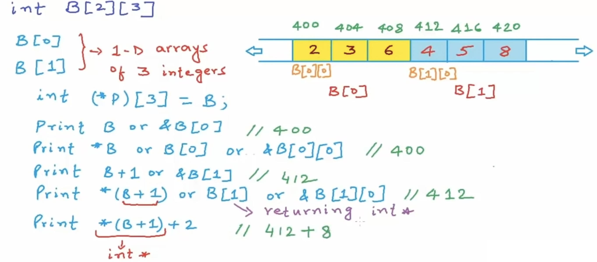

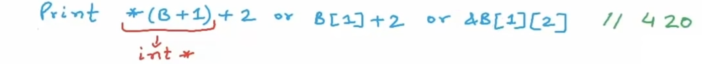

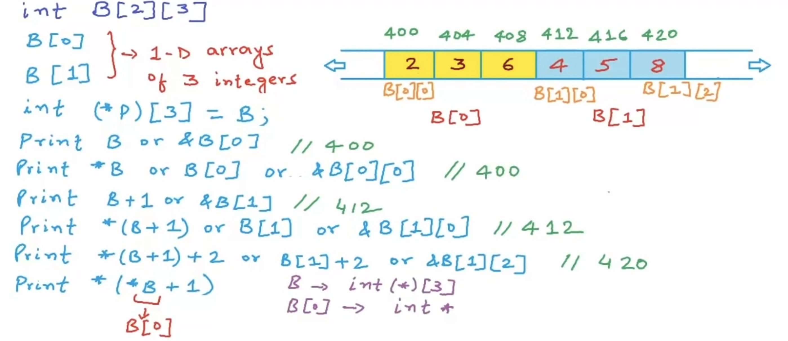

* **B** 会给我们一个 **一维数组指针**
* ***B** 是二维数组的第一个元素，即第一个一维数组**B[0]**，数组就是指向其第一个元素的指针，所以是一个 **整数指针**

* ***B+1** 是整数指针，指向404
* `*(*B+1)` 是整数值，3

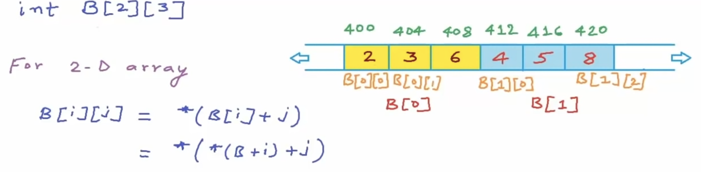

* the array name will return us a pointer to the first element of the array
* `int (*p)[3] = B;`
  * So B wil return us a one-dimensonal array of 3 elements
  * a variable witch is pointed to one-dimensional array of 3 integers
  * and the name of the varible is p

* B会给我们返回a pointer to one-d array of 3 integers
* *B 会给我们返回a pointer to an integer

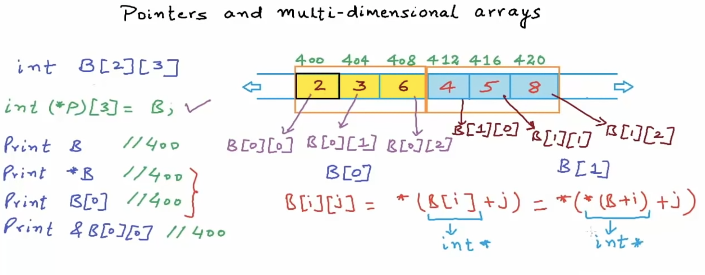


三维数组与指针：

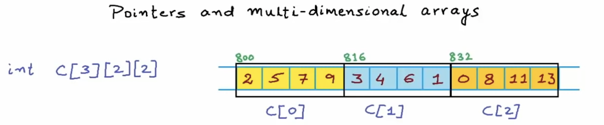

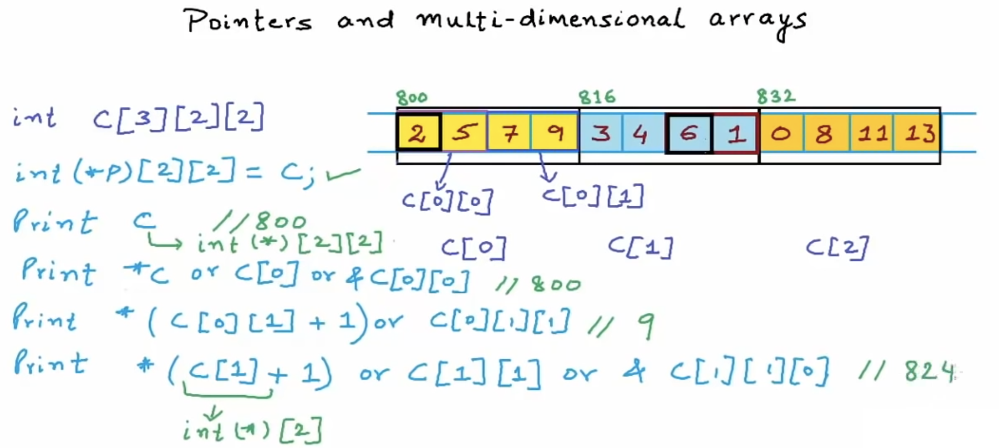


> 关于二维数组作为参数练习：
>
> ```c
> #include <stdio.h>
> #define LEN 10
> 
> int sum_2D_array(const int a[][LEN],int n){
>     int sum=0, *p;
>     for(p=a[0];p<a[0]+n;p++){  //a是二维数组名，是指一维数组的指针。a[0]是第一个一维数组的第一个元素，是一个整数指针。
>         sum+=*p;
>     }
>     return sum;  //只需要找到第一个元素，和(知道)n，就可以根据连续地址，找到所有数组里的元素。
> }
> int sum_1_col(const int a[][LEN], int n, int i){
>     int sum=0,(*p)[LEN];
>     for(p=a;p<a+n;p++)  //a是二维数组名，是指向一维数组的指针，p++可以逐个访问所有一维数组。
>     	sum += (*p)[i];  //*p得到该一维数组的第一个数的整数指针，**p是第一个一维数组第一个整数。
>   	//一维数组中：p[i], 是整数指针p右移i位，然后取值。p[i]==*(p+i)。
>   	//二维数组中：a是指向第一个一维数组的指针
>   					//  *a是a[0],是&a[0][0],是指向第一个一维数组的第一个元素的指针（整数指针）
>   					//  *a[i]是第一个一维数组的第一个元素的指针右移i位，然后取值。即*(*p+i),*p第一个元素右移2位，然后取值。
>     return sum;
> }
> int main(int argc, const char * argv[]) {
>     
>     int a[3][10] = {0,1,2,3,4,5,6,7,8,9,
>                     10,11,12,13,14,15,16,17,18,19,
>                     20,21,22,23,24,25,26,27,28,29};
>     int s = sum_2D_array(a,30);
>     printf("%d\n",s);
>     int s2 = sum_1_col(a,3,1);
>     printf("%d\n",s2);
>     printf("%d\n",*a[1]);  //10
>     printf("%d\n",(*a)[1]);//1
> }
> //435
> //33
> ```
>
> * 写法不易阅读，容易误解，要努力记忆。
> * 一维数组中：
>   * **a**是指向第一个数的（整数指针）。
>   * **a[i]**是一个（整数）。因为`a[i] == *(a+i)`，即是a指针右移 i 位然后取值，得到第 i 位的整数。
> * 二维数组中：
>   * **a**是指向第一个一维数组的（一维数组指针）
>   * **a[i]**是指向第i个一维数组取其第一个整数的（整数指针）。因为`a[i] == *(a+i)`，一维数组指针右移 i 位，然后取值，得到第i位一维数组的第一个整数的指针。
>   * `a[i][j]` 是一个整数，是第i行第j列的（整数）。a[i]是一个整数指针，向右j，再取值，得到第j个数的值。
>   * ***a**是第一个维数组的第一个整数的（整数指针）。**a则取到了第一个一维数组的第一个整数的值。
>   * ***a[i]**是先a[i]再取值。`*(a[i]) == *(*(a+i))`
>     * a先右移(得第i位的一维数组指针)再取值(得第一个整数的整数指针)，再取值，得**第i行第一个整数**。
>   * **(*a)[i]**是先`*a`再`[i]`。`== *(*a+i)`
>     * a是指第一维的一维数组指针，先取值(得第一维第一个整数的整数指针)，再右移i位，再取值，得**第一行第i个整数**。
> * `(*a)[i]和*a[i]`的区别。
>   * **[] 优先级 高于 ***
>   * `*a[i] == *(a[i])`，即a是一维数组指针指向第一个一维数组起始位置，`a[i] == *(a+i)`，是a向右移动i位，得到指向第i个一维数组的指针，然后取值（取到第i个一维数组的第一个整数的指针），所以是第二维第一个数的指针。然后`*(*(a+1))` 得到第二维第一个数的整数。**这种方法取到的是第i行的第一个整数。**
>   * `(*a)[i] == *(*a+i)`，即*a取第一维数组第一个数的指针（整数指针），+i，又移i位，再取值。**这种方法取到的是第一行的第i位整数。**
>   * 所以总结：
>     * 如果要取二维数组的行：for(p=a[i]; p<a[i]+col; p++), p是第i行第一个整数的指针，取值用*p。
>     * 如果要取二维数组的列：for(p=a; p<a+row; p++), p是每一行一维数组指针，取第i列的值用(*p)[i]。

2.7 13.3 done

2.8 13.5.1 done

2.10 13.6 done

2.12 13 done

2.19 slide 2

2.25 slide notes 3~6.2

2.26 slide notes 6 done

2.27 slide notes exercise 234 done

2.28 exercise 2-5 done

3.1 slide note 8 start 。。。