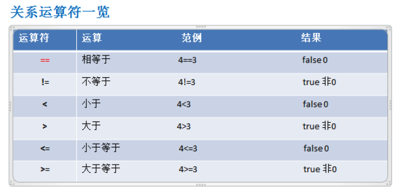

# 授课方法和体系

授课方式：

* 应用场景 -> C语言知识点 -> 剖析原理 -> 分析实现步骤 -> 代码实现及讲解
  * 例如：提出一个实际需求 -> 传统方法解决 -> 分析传统方法的缺点 -> C语言知识(结构体基本原理及快速入门案例) -> 注意事项和细节、使用陷阱等（考试和做项目时需注意的点） -> 应用案例

* 穿插讲解C语言考试真题《全国计算机二级C语言考试》——National Computer Rank Examination(合格、优秀、良好)
* 掌握C语言本质，通过二级考试，独立完成难度不大的C项目、C游戏。
* 深入到位地掌握知识

# C语言内容介绍

几个经典程序：

* 坦克大战
* 连连看
* 猴子吃水果

经典管理系统：

* 家庭记账软件
* 客户关系管理系统

> 同时参考配套《真题讲解》视频

C语言学习方向：

* C语言开发工程师（服务器）
* 嵌入式软件开发（C）
* Linux C/C++ 软件工程师

C语言知识体系：

* 见知识体系图

# C语言程序基础

## 〇、前置介绍

### 0.1 什么是程序

**程序**：为了让计算机执行某些操作或解决某个问题而编写的**一系列有序指令的集合**。

* 老板让秘书做以下事情：① 做会议记录 ② 给相关部门发邮件 ③ 传真会议记录

* 秘书按①②③按顺序执行完毕。

计算机程序：逐条执行指令。

下面尝试写第一个C语言程序：

```c
#include<stdio.h>
void main(){
  printf("做会议记录");
  printf("给相关部门发邮件");
  printf("传真会议记录");
}
//编译  执行
```

### 0.2 C语言发展历程

**C语言之父、Unix之父：**丹尼斯·里奇（Dennis Ritchie）。

20世纪60年代，丹尼斯·里奇和肯·汤普逊参与了贝尔实验室[Multics](https://zh.wikipedia.org/wiki/Multics)系统的开发。然而之后不久贝尔实验室又撤出了Multics计划，于是汤普逊找到了一台[PDP-7](https://zh.wikipedia.org/wiki/PDP-7)机器，从头开始开发应用程序和操作系统（主要用汇编语言）。在此期间，丹尼斯·里奇和汤普逊也带领团队进行系统的开发工作。1970年，[布莱恩·柯林汉](https://zh.wikipedia.org/wiki/布萊恩·柯林漢)建议把系统命名为“Unix”，与“Multics”名字相对。在完成Unix系统开发的基本工作之后，汤普逊觉得Unix系统需要一个系统级的编程语言，便创造了[B语言](https://zh.wikipedia.org/wiki/B語言)。后来丹尼斯·里奇则在B语言的基础上创造了[C语言](https://zh.wikipedia.org/wiki/C語言)。

从此，C语言成为了编写操作系统的主要语言。

**影响：**C语言深刻影响了后来的很多编程语言，比如C++、C#、Java、PHP、JavaScript、Perl、LPC、Unix的C shell等。

C语言是其他编程语言的核心基础。

**C语言标准发展：**


* C语言的两个重要版本：C89，C99。

**C语言的特点：**

* 代码级别的跨平台。由于标准的存在，使得几乎同一的C代码可用于多种操作系统，多种机型。
* 允许直接访问物理地址，对硬件进行操作。C语言可以直接访问物理地址，所以可以直接对硬件进行操作。因此它即具有高级语言的功能，又有低级语言的许多功能。C语言可以用来写系统软件——比如操作系统、数据库、杀毒软件、防火墙、驱动、服务器程序等等。
* C语言是一个有结构化程序设计、具有变量作用域（variable scope）以及递归功能的过程式语言。

* C语言传递参数可以是值传递（pass by value），也可以传递指针（a pointer passed by value，传的是地址）。
* C语言中，没有对象，不同的变量类型可以用结构体（struct）组合在一起。
* 预编译处理（preprocessor）生成目标代码质量高，程序执行效率高。

**C语言开发工具：**

1. Microsoft Visual C++（6.0版本）
2. Microsoft Visual Studio
3. Dev C++ code::Blocks
4. High C、Turb C、gcc、C-Free和Win-T等

* 2018年3月起，全国二级C语言平台更改为VC++2010 Express版。

* Visual C++ 2010 Express是一款IDE（集成开发程序）。安装完开发工具，还要安装C的运行时组件。

### 0.3 教学术语

学习建议：

1. 学习是一件独立的事情，先自己尝试独立搞清楚，不懂的看书翻资料，而非花太多时间跟同学交换意见。
2. 学习编程是一件很容易产生幻觉的事情。看起来简单易懂，合上书，打开键盘，还是敲不出一行正确的代码。所以，再简单的作业，也要亲自操作一遍，发现自己的惯性和错误，纠正自己的肌肉记忆，而非理性记忆。

术语：

* 函数，又称为方法
* 程序控制台，也成为终端，计算机最原始的样子。

参考阅读：

《编码》。从零到一创建一台电脑，帮助你理解计算机的底层工作原理。


参考视频：


### 0.3.1 C语言快速入门

1. 创建一个空项目（VC2010以项目为单位管理我们的代码）
2. 将C代码写入名为xxx.c的C文件中。
3. 编译执行代码。

```c
//1.1 新建项目 -> 空项目 -> 修改项目名称、保存项目路径
//1.2 右键选中源文件 -> 添加新建项 -> C++文件（修改文件名为hello） -> 把hello.cpp文件重命名为hello.c
#include <stdio.h>
void main(){  //①
  printf("hey hello;");  //②
}
```

① 任何一个程序的入口，就是它的main函数。即程序代码的执行，从main函数开始。

② printf()函数存放在一个头文件<stdio.h>中，所以要在程序开头引入此头文件(`#include <stdio.h>`)才可以使用这个函数。

③ 设置字体：工具->选项->字体和颜色：14，粗体。

④ 设置执行：


* 代码中加入一行：`getchar();` 让窗口停留。 

### 0.3.2 C程序项目运行机制

1. 编写源代码：即编写hello.c文件。
2. 编译：编译hello.c文件为hello.obj文件（此步骤在计算机底层执行）。
3. 链接：将hello.obj文件＋库文件生成MyProject01.exe可执行文件（此步骤在计算机底层执行）。
4. 运行：执行.exe文件，得到运行结果。


* cl.exe和link.exe存放在VC2010目录下的VC/bin文件夹。

> 知识清单：
>
> * 要知道C安装的路径
> * 要知道IDE存放的路径
> * 要知道项目路径
> * 要知道C语言的运行机制
>
> 学习C语言的注意事项：
>
> * 先明白逻辑，再用IDE
> * 所有讲过的操作一定要动手执行，学习编程是一件很容易有幻觉的事情。工科，说到底，是手艺，是熟练度，是肌肉记忆。

#### 编译：

编译是将源文件通过编译器编译为.obj文件的过程。

如果程序没有错误error，没有警告warning，那么Debug目录下会出现对应的`文件名.obj`文件，即目标文件。

#### 链接：

将.obj文件通过链接所需的c库文件来转为.exe文件。

如果程序没有error, warning, 那么Debug目录下会出现`项目名.exe`文件。

库文件是用来支持我们C程序正常执行的底层文件，比如<stdio.h> <stdlib.h>等，它们中分别包含有我们经常需要使用的printf()方法和system()方法。

.exe文件比.obj文件大很多。

#### 运行：

双击.exe文件即可运行程序，此过程称为执行程序。

#### C程序开发注意事项：

* 修改：每一次修改.c文件后，都需要重新编译.c文件，重新生成一系列对应.obj文件和.exe文件，再双击执行，修改才能生效。

* C程序的主体结构：

  ```c
  //1. 引入头文件
  # include <stdio.h>
  //2. 程序执行入口：main()方法。void表示方法返回类型，main函数没有返回值。
  void main(){
    //语句1
    //语句2
    ...
  }
  ```

  * { ... }包含的内容，为函数体（方法体）。

* C程序的源文件以.c为扩展名

* C程序的执行入口是main()方法

* C程序严格区分大小写

  * main≠Main

* C程序由一条条语句构成，每个语句以`;`结束（英文字符）

* 大括号都是成对出现，缺一不可

### 0.4 C语言转义符

* `\t`  制表符：把每个元素当做表格元素来对齐。预留8个字符的显示宽度。
* `\n` 换行符：光标移动到下一行
* `\\` \符号
* `\"` "符号
* `\'` '符号
* `\r` 回车符：光标回到本行行首

> word中的enter回车其实是\n\r结合。

例子：`printf("张无忌赵敏周/r芷若小昭")` 会输出什么？

* 芷若小昭敏周

> 课堂练习：
>
> 请输出

### 0.5 常见问题及解决方法

1. fatal error LNK1104：无法打开文件
   * 关闭已打开的控制台程序，然后重新编译运行
2. 语法错误：缺少";"
   * 仔细检查代码中的;是否有缺失。可以根据错误提示信息找到错误所在行数。

> 最容易犯的错误就是语法错误。程序编写过程中，请注意`;`  `{ }`  `""` 字母大小写、单词拼写错误、中英文符号混用等语法错误。可以参考报错信息来定位错误所在位置。

### 0.6 代码注释

代码注释是对程序代码的文字性解释。用于提高程序的可读性。

* 单行注释：//单行注释balabala

* 多行注释：

  ```c
  /* 多行注释balabala
  	abababababa
  	lilili
  */
  int a = 3; //这是一个单行注释
  ...
  ```

  * 注释不会被编译，所以注释内容不会被执行
  * 多行注释嵌套使用会产生混乱，所以不建议这样使用

> 设置编辑器添加注释快捷键

注释风格：

* 注释函数中的某个语句时，用单行注释
* 注释一个完整的函数时，用多行注释

代码缩进：

​		为了更好地呈现代码，提高代码的可读性，代码不要黏在一起书写，而要分行错落，利用tab和shift+tab来回调整代码的缩进距离，使代码的整体风格清晰可读。

* tab：增加缩进，代码整体向右移动
* shift+tab：减少缩进，代码整体向左移动

* 在运算符的左右增加空格，便于阅读代码。

> 设置代码布局快捷键

* 次行风格 vs 行尾风格

### 0.7 C语言标准库

C语言标准库是一系列C内置的函数、常量和头文件。比如<stdio.h> <stdlib.h> <math.h>等等。

这些是C语言设计者已写好的方法库，我们可以直接调用，而不用自己亲手去设计这些方法。使用前需要文件引入。

## 一、 核心基础

### 1.1 什么是变量

1. **一个程序就是一个世界。**我们的世界中有很多不同的事物。

2. 在程序中，我们用不同的变量来表示不同的事物。
3. **变量是程序的基本组成单位。**

```c
void main(){
	int a = 3;
  int b = 5;
  b = 99;
  printf("a=%d\n",a);
  printf("b=%d\n",b);
  getchar();
}
```


* 变量来源于数学，是计算机语言中能储存计算结果或能表示值的抽象概念。变量可以通过变量名访问。在指令式语言中，变量通常是可变的；——百度百科
* 在程序设计中，变量（英语：Variable，scalar）是指一个包含部分已知或未知数值或信息（即一个值）之存储地址，以及相对应之符号名称（识别字）。通常使用变量名称引用存储值；将名称和内容分开能让被使用的名称独立于所表示的精确消息之外。——维基百科

### 1.1.2 变量的使用

1. 声明变量：int num;
2. 赋值：num = 60;
3. 使用：printf("%d",num);

* 声明＋赋值：int num = 60;

数据类型：

```c
int num = 1;//整数
double b = 2.3;//小数
char a = 'A';//字符
char name[] = "字符串";
printf("num=%d,b=%.2f,a=%c,name=%s",num,b,a,name);
```

### 1.1.3 变量使用的注意事项

1. 变量表示内存中的一个存储区域（不同的数据类型，占用空间大小不一样），用于存储一个值。

2. 该区域有自己的名(变量名)和类型(数据类型)

   * C语言中的变量严格区分带小写，即变量Num和num是两个不同的变量。

   * ```c
     int num = 3;
     Num = 4;//错误：Num没有被声明过。
     ```

3. 变量必须先声明，后使用

4. 该区域中所存储的数据（数值）可以在同一类范围内不断变化

   * `int a = 3;  a=3.2`  会产生warning：double到int可能丢失数据

5. 变量在同一个作用域内不能重名
   * `int num = 3; int num = 9;` 会产生error：num不能重新定义（多次初始化）
6. 变量三要素（数据类型、变量名、值）

### 1.2 变量的数据类型


注意：

1. C语言的基本类型中没有字符串类型，而是用字符数组表示字符串
2. 在不同系统上，部分数据类型字节大小不同（下面具体解释）

#### C语言的基本类型概括：

整型：

1. short int
2. unsigned short int
3. int
4. unsigned int
5. long int
6. unsigned long int
7. （C99）long long int
8. （C99）unsigned long long int

浮点型：

1. float
2. double
3. long double
4. （C99）float_Complex 复数类型
5. （C99）double_Complex
6. （C99）long double_Complex

字符型：

1. char

### 1.2.1 整型

C语言中的整数有6种（此外C99标准又增加了2种）。它们的作用都只是用于存储一个整数。但是由于数值的大小不同，出于合理分配计算机内存的考虑，C语言的整数类型细分成了6种不同类型，用来方便不同运算量级的程序使用。

C语言整型的尺寸因系统的CPU位数不同而不同。古老的16位操作系统和现代的64位操作系统在内存分配上有所不同，这导致了它们在运算范围和能力上有巨大的差异。但是不论是哪一种操作系统，C语言整型的内存分配必将遵循如下规则：

* short <= int
* int <= long
* 即，不论在何种系统中，short所占的内存必然少于或等于int，int也少于或等于long。

一般情况下，我们最常使用int类型来作为整数类型（它的取值范围在32位和64位系统中是-2147483648 ~ 2147483647），如果需要表示大数则使用long类型，如果要节省内存且数值在对应范围之内，则使用short类型。

同时需要注意的是，我们所介绍的各种整型所占内存和数值范围（包括下面三个表格所包含的信息），是C标准中所规定的，但C标准并不是强制实现的，且因为编译器的不同而不同，所以不同的系统在实现中仍有微小差异。如果想要查看整数类型的实际范围，可以检查<limits.h>头文件，其中定义了表示每种整数类型的最大值和最小值的宏。

* 16位机的整数类型

  |      类型      | 比特数(bits) | 字节数(bytes) |   最小值    |   最大值   |
  | :------------: | :----------: | :-----------: | :---------: | :--------: |
  |     short      |      16      |       2       |   -32768    |   32767    |
  | unsigned short |      16      |       2       |      0      |   65535    |
  |      int       |      16      |       2       |   -32768    |   32767    |
  |  unsigned int  |      16      |       2       |      0      |   65535    |
  |      long      |      32      |       4       | -2147483648 | 2147483647 |
  | unsigned long  |      32      |       4       |      0      | 4294967295 |

* 32位机的整数类型

  |      类型      | 比特数(bits) | 字节数(bytes) |   最小值    |   最大值   |
  | :------------: | :----------: | :-----------: | :---------: | :--------: |
  |     short      |      16      |       2       |   -32768    |   32767    |
  | unsigned short |      16      |       2       |      0      |   65535    |
  |      int       |      32      |       4       | -2147483648 | 2147483647 |
  |  unsigned int  |      32      |       4       |      0      | 4294967295 |
  |      long      |      32      |       4       | -2147483648 | 2147483647 |
  | unsigned long  |      32      |       4       |      0      | 4294967295 |

* 64位机的整数类型

  |      类型      | 比特数(bits) | 字节数(bytes) |           最小值           |           最大值           |
  | :------------: | :----------: | :-----------: | :------------------------: | :------------------------: |
  |     short      |      16      |       2       |           -32768           |           32767            |
  | unsigned short |      16      |       2       |             0              |           65535            |
  |      int       |      32      |       4       |        -2147483648         |         2147483647         |
  |  unsigned int  |      32      |       4       |             0              |         4294967295         |
  |      long      |      64      |       8       | -9 223 372 036 854 775 808 | 9 223 372 036 854 775 807  |
  | unsigned long  |      64      |       8       |             0              | 18 446 744 073 709 551 615 |

> 补充知识：
>
> ##### 一、计算机数据存储单位：
>
> | 中文单位 | 中文简称 |   英文单位   | 英文简称 |     换算关系     |
> | :------: | :------: | :----------: | :------: | :--------------: |
> |    位    |   比特   |     Bit      |    b     |   `1b=0.125B`    |
> |   字节   |   字节   |     Byte     |    B     |     `1B=8b`      |
> |  千字节  |  千字节  |   KiloByte   |    KB    | `1KB` = `1024B`  |
> |  兆字节  |    兆    |   Megabyte   |    MB    | `1MB` = `1024KB` |
> |  吉字节  |    吉    |   Gigabyte   |    GB    | `1GB` =`1024MB`  |
> |  太字节  |    太    | Trillionbyte |    TB    |  `1TB`=`1024GB`  |
> |  拍字节  |    拍    |   Petabyte   |    PB    | `1PB` =`1024TB`  |
> |  艾字节  |    艾    |   Exabyte    |    EB    |  `1EB`=`1024PB`  |
> |  泽字节  |    泽    |  Zettabyte   |    ZB    |  `1ZB`=`1024EB`  |
> |  尧字节  |    尧    |  Jottabyte   |    YB    | `1YB` = `1024ZB` |
>
> 1. bit 比特：表示0或1，可以代表2种可能性
> 2. byte 字节 = 8 bits：可以代表2^8 (256) 种可能性
> 3. 以此类推......
>
> 补充知识：计算机底层逻辑原理
>
> * 操作系统是什么
> * 计算机如何实现逻辑运算
>
> ##### 二、有符号整数 VS 无符号整数：
>
> 在计算机底层原理中，数字的存储用二进制比特位来表示：
>
> 例如：`short int a = 3;`
>
> * 在计算机内存中，系统给short int类型的变量a开辟了2个字节(16bits)的存储空间来存放它的数值。（16位、32位、64位系统）
>
> * 所以变量a中所存的值3，在内存中表示为：0000 0000 0000 0011。
>
> * 在本例中，其最左位为符号位：
>
>   * 有符号的整数，其最左位为0表示正数，为1表示负数。所以short int的取值范围是-2^15 ~ 2^15-1，即-32768~32767，二进制表示为：1000 0000 0000 0000 ~ 0111 1111 1111 1111
>
>     * 计算机数值存储都以补码形式存储
>
>       * 正数补码 = 原码；
>       * 负数补码 = 反码+1；（反码：符号位不变，其余取反）
>
>     * -32767的二进制数：
>
>       * 原码：1111 1111 1111 1111
>       * 反码：1000 0000 0000 0000
>       * 补码：1000 0000 0000 0001
>
>     * -32768的二进制数：
>
>       * 原码：1000 0000 0000 0000
>       * 反码：1111 1111 1111 1111
>       * 补码：1000 0000 0000 0000
>
>     * 为什么要使用补码的形式呢？
>
>       例如在减法运算中，可以看作是正数和负数的加法操作，使用补码的形式表示数值，我们就可以直接将x-y表示为 x + (-y)的处理过程。计算机只要部署加法电路和补码电路就可以完成所有整数的加法、减法操作。
>
>   * 无符号的整数，其最左位也是数值的一部分。所以unsigned short int的取值范围是0 ~ 2^16-1，即0~65535，二进制表示为：0000 0000 0000 0000 ~ 1111 1111 1111 1111
>
> 默认情况下，C语言的整型变量都是有符号的，即最左位保留为符号位。若要告知编译器变量没有符号位，则需要使用unsigned来声明。
>
> ##### 三、思考：
>
> ```c
> short a = 3;
> int b = 3;
> ```
>
> 在内存中的有何不同？
>
> * 有符号16bits
> * 有符号32bits

整型使用细节：

* 如果没有特殊说明，我们一般所说的int是signed int，即带符号的int类型。
* unsigned int不一定会被所有操作系统识别，以上定义只是标准定义，并不是严格强制执行的。
* 在C语言中，数据类型所占用的字节数（存储值的范围大小）与操作系统、系统位数、编译器有关。目前最通用的是64位操作系统。实际工作中，C程序通常运行在linux/unix操作系统下。二级考试用的是windows系统。

* 操作系统编译器和数据类型所占字节数的关系图

  

  * Windows 32位和64位编译结果一样。

### 1.2.2 浮点型

浮点型可以表示一个小数。例如：12.34，0.07等等。

浮点型的分类：

|     类型      | 比特数(bits) | 字节数(bytes) |   最小正值    |    最大值    |   精度   |
| :-----------: | :----------: | :-----------: | :-----------: | :----------: | :------: |
| float 单精度  |      32      |       4       | 1.176*10^-38  | 3.403*10^38  | 6位小数  |
| double 双精度 |      64      |       8       | 2.225*10^-308 | 1.798*10^308 | 15位小数 |

* 浮点数在计算机中存放的形式为：浮点数 = 符号位 + 指数位 + 尾数位。
  * 浮点数有正负数
* 尾数位可能丢失，造成精度损失。
  * 所以说，浮点数其实都是近似值

浮点型使用细节：

1. 浮点数**常量**默认为double型。比如：数字1.1，计算机读取它时，默认将它读取为double类型。

   声明float类型**常量**时，要在数字后面加 f 或 F。

   * 常量：即我们所设置的数字。
   * 变量：一个存储值（往往是数值）的内存区域。
   * 变量名：内存区域的名称（我们自定义的名称，方便在程序中调用，寻址）。

   ```c
   float f1 = 1.1; //会产生warning：从double到float会导致数据损失
   float f2 = 1.1f; //正确
   double d1 = 1.2; //正确
   ```

2. 浮点型常量的两种表示方式：
   1. 十进制数形式：5.12、512.0f、**.512**、**57.** (必须有小数点)
   2. 科学计数形式：5.12E2、5.12e-2、57.0e0、.57e-1
      * E或e均可，表示x10的n次幂
      * E/e之后的`+ -`号表示要对前面的数进行缩放所需的幂次。

3. 通常我们使用double类型，因为double精度更高

4. 输出时，%f 默认保留6位小数：

   * `float f1 = 1.1; printf("%f", f1);` //输出：1.100000

   * `double d1 = 1.123456789; printf("%f",d1);`//输出：1.123457（四舍五入）

   * 如果我们想保留15位小数：`printf("%.15f",d1);` //保留15位小数，输出：1.123456789000000

   * 如果是float还想保留15位小数：`float f2 = 1.123456789; printf("%.15f",f2);` //输出会出现错误数据：1.123456789723846

### 1.2.3 字符型

char字符型用来表示单个字符，任意单字符可以对char类型变量进行赋值。

内存：char类型所占内存为1个字节，即8bits，取值范围（-128~127 或 unsgined char : 0~255）。

字符集：一般我们最常用的编码集为ASCII码（美国信息交换标准码），它用7位代码表示128个字符，范围从0~127。

```c
char ch;
ch = 'A';
ch = 'a';
ch = '0';
ch = ' ';//空格符
ch = '\t';
printf("%c",ch);//输出char所对应的char值
printf("%d",ch);//输出char所对应的整数值（int值）
```

注意事项：

* 字符用单引号括起，而不是双引号。
* 转义字符：例如：`\t  \n  \r` 等等，也是字符，注意在给char型赋值时要加上单引号，即`char ch = '\t';`

* 字符串：C语言中的字符串由char数组表示，数组不是基本数据类型，而是构造类型。

* char的本质：在C语言中，char的本质是一个整数，可以给char赋一个整数。

  * char值在计算机中的存储和读取：

    * 存储：字符'a' --> 码值97 --> 二进制110 0001 --> 存储(0110 0001)（1字节）
    * 读取：二进制110 0001 --> 码值97  --> 字符'a' --> 读取显示(a)
    * 字符和码值的对应关系，由计算机系统所用的编码字符集决定（我们通常使用ASCII码表）。
    * ASCII码表有明显的缺陷：不能表示所有字符，比如中文符号、日文符号等。更多现代语言中扩展了新的编码字符集，比如GBK、Unicode编码集等。

  * 所以说，char在计算机中的本质是int值，且范围在-128~127或0~255。

  * 因此，char可以参与整数运算。

  * 如果给char赋值超过它取值范围的整数值会产生警告，并且编译所得出的数值并不正确：

    ```c
    char c1 = 128;//编译时会产生warning -> 强行执行会输出错误结果
    char c2 = 127;//编译正确✔️
    char c3 = 255;//编译时产生warning -> 强行执行会输出错误结果
    unsigned char c4 = 255;//编译正确✔️
    unsigned char c5 = 256;//编译时产生warning -> 强行执行会输出错误结果
    char c6 = -128;//编译正确✔️
    ```

  * 输出char：

    * 在printf()语句中，%c表示输出char值，%d表示输出整数值（十进制）。

    ```c
    #include <stdio.h>
    void main(){
    	char a = 'a';
      char b = 98;
      printf("%c,%c",a,b);//a,b
      printf("%d,%d",a,b);//97,98
    }
    ```

> VS2010的编译器是C89
>
> * C89要求所有的变量定义都放在赋值或执行语句之前。
>
> ##### 练习：
>
> ```c
> char c = 'a';
> //如何把c变成'A'? ①直接赋值  ②整数运算
> //ch = ch -'a' + 'A';
> ```

### 1.2.n C语言中基本数据类型所占字节表

|      类型      | 16位 | 32位 | 64位  |
| :------------: | :--: | :--: | :---: |
|    **char**    |  1   |  1   | **1** |
|     short      |  2   |  2   |   2   |
| unsigned short |  2   |  2   |   2   |
|    **int**     |  2   |  4   | **4** |
|  unsgined int  |  2   |  4   |   4   |
|    **long**    |  4   |  4   | **8** |
| unsigned long  |  4   |  4   |   8   |
|   **float**    |  4   |  4   | **4** |
|   **double**   |  8   |  8   | **8** |

* 缺少long long、unsigned long long和long double。
* 32位系统中，各数据类型所占字节数为：short - 2; int - 4; long - 4; float - 4; double - 8。

### 1.2.4 布尔型 boolean

布尔Boolean是一种逻辑数据类型，以发明布尔代数的数学家乔治·布尔为名。它是只有两种——真和假。

java语言中。boolean值有两个：true和false。

C语言中没有定义布尔类型，而是规定：0为假，非0为真。（-1也是真）

```c
#include <stdio.h>
//宏定义
#define BOOL int
#define TRUE 1
#define FALSE 0
void main(){
  BOOL isTrue = TRUE;//等价于 int isTrue = 1;
  if(isTrue){
    printf("真");
  }
}
```

* `#define`指令定义了一个宏——用来代表其他东西的一个名字。
* `#include`指令告诉预处理器打开一个特定的文件，将它的内容作为正在编译的文件的一部分”包含“进来。

> C99标准提供了_Bool类型，它仍然是整数类型，但只有0或1两个值。非0的值会被存为1。C99还提供了一个头文件<stdbool.h>定义了bool代表`_Bool`，true代表1，false代表0。所以当我们引入stdbool.h文件时，我们就可以很方便地操作布尔类型。eg：bool flag = false;

布尔类型使用：if条件语句或while循环语句

### 1.3 基本数据类型转换

计算机在执行算数运算时，通常要求操作数有相同的比特位数，且存储方式也相同。

* 比如，16位的整数和32位的整数不能直接相加；32位的浮点数和32位的整数也不能直接相加。

C语言则允许在表达式中混合使用基本数据类型。在这些混用情况下，C编译器会生成一系列指令来使得硬件可以对表达式进行计算。数据类型转换有两种方式：

1. 隐式类型转换。即自动类型转换，无需程序员介入，编译器自动完成。这种情况发生在：
   * 当算术表达式或逻辑表达式中操作数的类型不同时
   * 当赋值运算符左侧和右侧的类型不匹配时
   * 当函数调用中的实参与对应形参类型不匹配时
   * 当return语句中表达式的类型和函数返回值的类型不匹配时

2. 显式类型转换。又称强制类型转换。

注意：类型转换只是在运算过程中对数值进行转换操作，但并不改变原值。

### 1.3.1 隐式类型转换

多种类型的数据混合运算时，隐式类型转换的原则是把操作数转换为可以安全地（精度最大）适用于两个数值的"最狭小的"数据类型。即：

1. 先把所有数据转换为精度最大的数据类型，然后进行计算。

   

   > 具体来说：
   >
   > 1. 有浮点型时：**float -> double -> long double** (精度从低到高)
   >    * 有long double：全转成long double再进行运算
   >    * 无long double有double：全转成double再进行运算
   >    * 无long double和double，有float：全转为float再进行运算
   > 2. 都不是浮点型时：（char/short -> ) **int -> unsigned int -> long int -> unsigned long int** (字节数从底到高)
   >    * 首先把char和short都转为int
   >    * 其次，找到其中字节数最大的类型，把所有数据都统一为字节数最大类型
   >    * 运算

2. 若两个类型字节数不同，则转换为字节数大的类型。如果两种类型字节数相同，其中一种是有符号类型，一种是无符号类型，都转为无符号类型。

3. 赋值运算中，等号左右两边类型不同时，右边类型转为左边类型。如果右边数据类型长度长或精度高，会导致丢失部分数据，造成降低精度。

```c
char c = 'a';
int num = c;//ok
double d1 = num;//ok

int num2 = num + c;//ok

float f = 1.1f;
double d = 1.12345678;
f = d;//此处在执行时，会产生精度损失（double -> float)
```

### 1.3.2 强制类型转换

将精度高的数据类型转换为精度低的数据类型时，需要进行强制类型转换。这可能会造成精度降低或溢出，要格外注意。

强制类型转换格式：

* ```c
  (类型名) 表达式
  ```

* 什么是表达式？【 ? 】

* 强制类型转换并不改变操作数本身

* 强制类型转换只针对最近的操作数有效，可以使用小括号提升优先级

例子：

```c
double d = 1.12345;
int num = (int)d; //强制把double类型的d转换为int类型
printf("%d",num); //1
printf("%f",d); //1.123450

int x1 = (int)2.3+3.8; //5
int x2 = (int)(2.3+3.8); //6
```

练习：

```c
char c = 'a';
int i = 5;
float f = .314F;
double d = 1.1;
double result = c+i+f;//float->double //ok
char result2 = c+i+f;//float->char 警告：数据精度损失
```

### 1.3.3 sizeof()运算符

`sizeof(类型名)` 可以返回所填写类型占用的字节数。

比如：sizeof(char)永远返回1，而sizeof(int)返回的值则因操作系统的不同而不同。

### 1.4.1 指针入门

指针：用来存放一个指定类型的变量的地址。

获取一个变量的地址：

```c
int num = 1;
printf("%p",&num);
```

声明&定义一个指针变量：

```c
int *pnum;//声明pnum为: 一个存放int型变量的地址的指针变量
*pnum = &num; //赋值
printf("pnum存放的值: %p，pnum所在的地址: %p",pnum,&pnum);
```

* 指针变量本身也有地址
* &取地址符
* *取地址所存的值
* pnum的类型为int *

通过指针获得所存地址中存放的值：

```c
printf("pnum所存地址所存的值: %d",*pnum);
```

修改指针中所存地址所存的值：

```c
int num = 1;
int *pnum = &num;
printf("%d",num);//1
*pnum = 2;
printf("%d",num);//2
```

指针使用：

1. 基本数据类型都要对应的指针类型：`数据类型 *`
2. 另外还有指向数组的指针、指向结构体的指针、指向共用体的指针（二级指针、多级指针）。

### 1.4.2 值传递和地址传递

**值传递（pass by value)**：变量指向的存储内容，在传递/赋值时，拷贝一份给接收变量。

**地址传递（a pointer passed by value)**：又称为指针传递。在传递/赋值时，将指针变量存储的地址传递给接收变量。如果是数组，则将数组首地址传递给接收变量。


> 默认值传递：基本数据类型，结构体，共用体
>
> 默认地址传递：指针，数组


### 1.5 常量

常量是固定值，在程序执行期间不能改变。这些固定的值，又叫字面量。

常量可以是任何基本数据类型，也可以是字符串字面量和枚举常量。

常量的值在定义后不能修改。

1. 整数常量（整型常量）

```c
85    //整数(int) - 十进制
0213  //整数(int) - 八进制
0x4b  //整数(int) - 十六进制
  
30    //整数(int) - 十进制
30u   //整数(unsigned int)
30l   //长整数(long int)
30ul  //无符号长整数(unsigend long int)
```

* 进制输出：%o, %d, %x
* u和l分别代表unsigend和long，u和l在使用时大小写均可。
* 十六进制的0x必须小写x，而十六进制的数值b使用大小写均可。

2. 浮点常量

```c
3.1415926 //默认double常量
3.14f     //float常量
314159E-5 //科学计数法
```

3. 字符常量

```c
'x'
'0'
' '
'\n'  //转义符也是字符常量
```

4. 字符串常量

```c
"I love Beijing"
""  //空串
" " //字符串中包含一个空格
```

```c
char love[20] = "I love \
Beijing"
```

* 相当于`"I love Beijing"`。

### 1.5.1 常量的定义

两种方法：

1. `#define` 预处理器定义常量

   ```c
   #define 常量名 常量值
   ```

   * 预处理命令独占一行，结尾不需要分号

   * 程序在编译之前，先进行预处理——替换头文件内容，去掉注释部分，把所有常量替换为常量值。

   * 一旦定义常量，常量不能再被重新赋值

     ```c
     #define PI 3.14
     void main(){
     	PI = 3.1; //error: PI不可以修改
     }
     ```

2. `const`关键字声明指定类型的常量

   ```c
   const 数据类型 常量名 = 常量值;
   ```

   ```c
   const float PI = 3.14f;
   void main(){
     PI = 3.1; //error
   }
   ```

   * const常量同样不能被重新赋值
   * 结尾需要加分号

3. 比较二者区别：

   |            const            |                           #define                            |
   | :-------------------------: | :----------------------------------------------------------: |
   | 定义常量时，要声明数据类型  |            定义常量时，无需声明数据类型，直接定义            |
   |     在编译、运行时生效      |                       在预处理阶段生效                       |
   |                             |       只是简单替换，没有类型检查，会导致**边界效应①**        |
   |      const常量可以调试      | #define常量不能调试，因为在预处理阶段就已经替换掉了，调试时它已经不存在了。 |
   | const常量变量不可以重复定义 | #define常量变量可以通过#undef取消某个符号的定义，再**重新定义②** |
   |                             | #define可以**配合#ifdef、#ifndef、#endif使用③**，使代码更灵活 |

   ① 什么是边界效应：

   ```c
   #define A 1
   #define B A+3
   #define C A/B*3
   void main(){
     printf("%d",C);//C=?
   }
   ```

   * 由于#define只是简单替换，所以`C = 1/1+3*3 = 10`，而并不是我们希望得到的`1/(1+3)*3 = 0`

     * 注意：整数除法只保留整数部分。

     * ```c
       double d1 = 1/4*3;  //d1依然是0，因为1/4是整数除法
       double d2 = 1.0/4*3;//d2=0.75
       ```

   * 所以在#define定义常量时，表达式要用小括号括起。

     ```c
     #define B (A+3)
     ```

     * 结果：0

   ② 重复定义：

   ```c
   #define PI 3.14
   #undef PI  //取消定义
   #define PI 3.33  //重新定义
   
   const double PL = 3.14;
   const double PL = 3.3;//error
   ```

   ③

   ```c
   #define DEBUG
   void main(){
   	#ifdef DEBUG
     	printf("ok");
     #endif
     #ifndef DEBUG  //#ifndef - 如果没有定义常量名 DEBUG
     	print("no debug");
     #endif
   }//输出: ok
   ```

### 2 运算符

运算符是特殊的符号，用来表示数据的运算、赋值和比较等。

1. 算数运算符：+ - * / %
2. 赋值运算符：= += -= *= %=
3. 关系运算符：> < >= <= ==
4. 逻辑运算符：&&  ||  ！
5. 位运算符：& | ^(按位异或)  ~(按位取反)

6. 三元运算符：表达式？表达式1：表达式2

### 2.1 算数运算符


除division：/

```c
int n1 = 10/3; //整数除法，得3
int n2 = -10/3; //符号保留，按正整数除法计算，得-3
```

模mod：%

```c
int res1 = 10 % 3; //res1 = 1
int res2 = -10 % 3; //?
int res3 = 10 % -3; //?
int res4 = -10 % -10; //?
```

* 取模公式：`a % b = a - a / b * b`

* res2 = -10 - (-10) / 3 * 3 = -10 - ( -3 * 3 ) = -1
* res3 = 10 - 10 / (-3) * (-3) = 10 - ( -3 * -3 ) = 1
* res4 = (-10) - (-10) / (-3) * (-3) = -10 + 9 = -1

自增自减：++ --

### 2.2 关系运算符

关系运算符的结果只有两个：真（用0表示）或假（用非0表示，默认输出1）

关系表达式常用在if结构语句或循环结构语句中



注意：

* = 表示赋值，==表示判断是否相等
* 由关系运算符组成的表达式，我们称之为**关系表达式**，例如：a>b。关系表达式的结果只有0或1，分别表示判断为假或真。

### 2.3 逻辑运算符

逻辑运算符用来连接多个关系表达式，其结果也只有两个：0或1，分别表示假或真。


* &&和||都有短路特性，即只要通过运算符左侧的表达式能直接判断出结果，后面的表达式就不会进行运算，直接跳过。
* 在计算逻辑表达式时，编译器会把每个表达式所计算出的结果转化为0或1，然后再进行逻辑判断，最终得出结果。

### 2.4 赋值运算符

即将赋值运算符右侧的表达式所得的值，赋给左侧变量。


