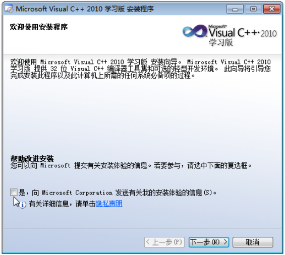
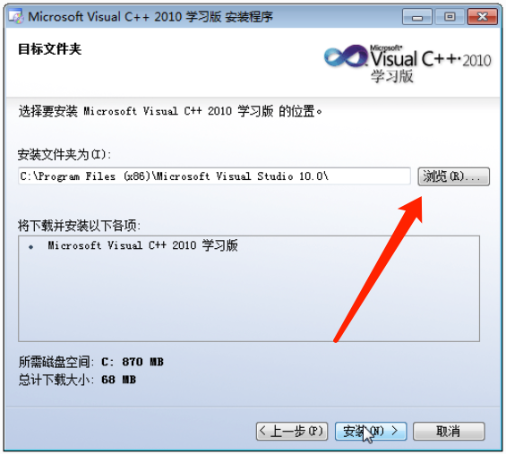

# 安装配置Microsoft Visual C++ 2010

### 一、安装

1. 双击VC2010版安装软件（.exe），进入安装程序

2. 取消勾选”是，向Microsoft Corporation发送有关我的安装体验信息“前的对勾。下一步。

   

3. 许可条款：选择”我已阅读并接受许可条款“。下一步。
4. 安装选项：全部取消勾选。如果必须选择一个，选择第一个（占用内存较小）。下一步。

5. 安装路径：
##### installation path

   

   * 默认存放在了C盘，为了不占用系统核心空间，请选择一个D盘文件夹进行存放。
   
     * 完全不会操作的同学可以参考以下步骤：
   
       1. 打开D盘 → 右键 → 新建文件夹  → 重命名文件夹为“Microsoft Visual C++ 2010”
   
       2. 把文件路径（D:\Microsoft Visual C++ 2010）复制到上面"安装文件夹为"下的白框中。
   
   * 点击安装。
   
6. 安装成功，退出。（安装时需要联网）

### 二、新建项目

VC2010对程序的管理是基于项目的，所以我们要学习如何创建一个新项目，从而使得我们写的C程序可以被编译执行。

下面是新建一个项目的具体步骤：

#  VC6.0安装

1. 双击VC6.0安装软件（.exe），进入安装程序

2. 下一步。下一步。

3. 选择安装的文件夹：[请参考VC2010的安装路径]:(#installation-path)。

   

   

