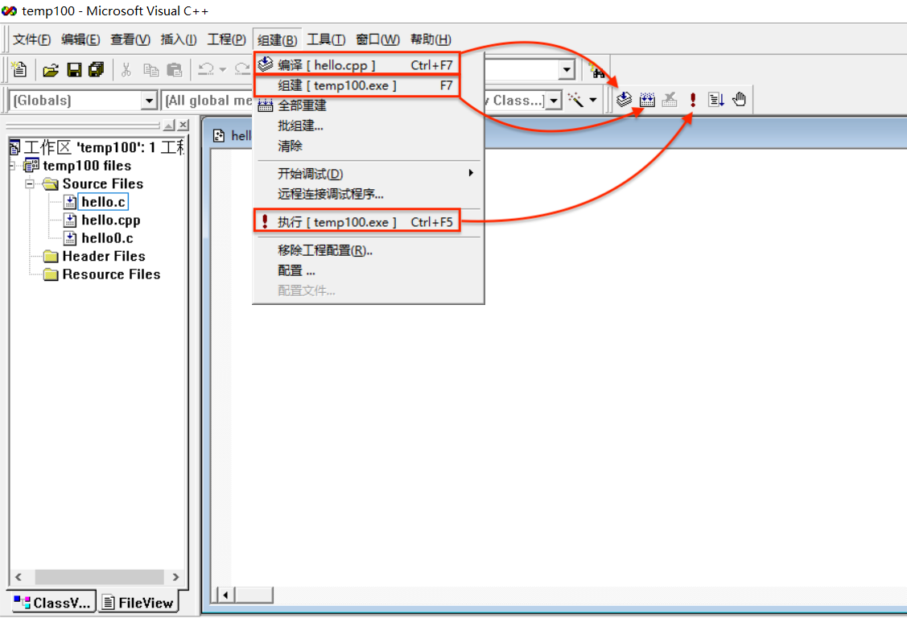
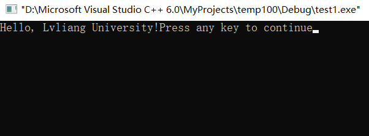

# 安装配置Microsoft Visual C++ 2010

### 一、安装

1. 双击VC2010版安装软件（.exe），进入安装程序

2. 取消勾选”是，向Microsoft Corporation发送有关我的安装体验信息“前的对勾。下一步。

   

3. 许可条款：选择”我已阅读并接受许可条款“。下一步。

4. 安装选项：全部取消勾选。如果必须选择一个，选择第一个（占用内存较小）。下一步。

5. 安装路径：

   

   * 默认存放在了C盘，为了不占用系统核心空间，请选择一个D盘文件夹进行存放。
     * 完全不会操作的同学可以参考以下步骤：

       1. 打开D盘 → 右键 → 新建文件夹  → 重命名文件夹为“Microsoft Visual C++ 2010”

       2. 把文件路径（D:\Microsoft Visual C++ 2010）复制到上面"安装文件夹为"下的白框中。
      * 点击安装。

6. 安装成功，退出。（安装时需要联网）

### 二、新建项目

VC2010对程序的管理是基于项目的，所以我们要学习如何创建一个新项目，从而使得我们写的C程序可以被编译执行。

下面是新建一个项目的具体步骤：


#  VC6.0安装

1. 双击VC6.0安装软件（.exe），进入安装程序
2. 下一步。下一步。
3. 选择安装的文件夹：[请参考VC2010的安装路径](#一、安装)。

  * 注意把新建文件夹重命名为“Microsoft Visual Studio 6.0”。

4. 完成。

### 一、新建C程序

0. VC6.0支持单个源文件的编译和链接，所以如果你只希望简单快速地测试程序执行结果，并不打算模块化管理整个程序，那么你可以直接跳到下一节（[新建C文件](#二、新建C文件)）开始。[跳转Test](#Test-link)

1. 双击桌面的"Visual C++ 6.0"打开程序。

2. 

3. 选择”一个空项目(E)“ → 完成。
4. 确定。

### 二、新建C文件

1. 
   * 注意：你输入的文件名如果自带`.c`后缀（如`hello.c`，那么程序会为你新建一个C文件。而如果你只输入的文件名没有带后缀（如`hello`），那么程序默认会为你新建一个以`.cpp`为后缀的C++文件。
   * 在我们的课程范围内，我们所写的程序在C++和C文件上都可以执行，所以不必纠结。

2. 

### 三、编辑源文件

这里我们尝试写入一个简单的C程序：

```c
#include <stdio.h>
void main(){
  printf("Hello, Lvliang University!")
}
```

### 四、编译和运行程序

编译：是把`.c`或`.cpp`文件

执行：

所有的C源文件都要经过：

* 预编译（我们并不会感受到它的工作）
* 编译
* 



* 不论使用哪种方式，编译和执行过后，我们就会看到程序中所定义的输出内容：

* 
* 注意：`Press any key to continue` 并不是程序指定的输出，而是编辑器自动加上的一行信息。此时你可以按任意键退出输出窗口。

> 如果编译运行不能进行，可能是兼容性问题。因为VC6.0原生是设计给XP系统用的，如果你的电脑是Win7/Win8/Win10系统，那么需要解决兼容问题。
>
> 处理方法：
>
> 1. 回到桌面，右键点击VC 6.0的快捷图标，点击属性。
>
> 2. 选择”兼容性“标签，将兼容模式改为”Windows XP (Service Pack 3)“。
>
>    

### Test link