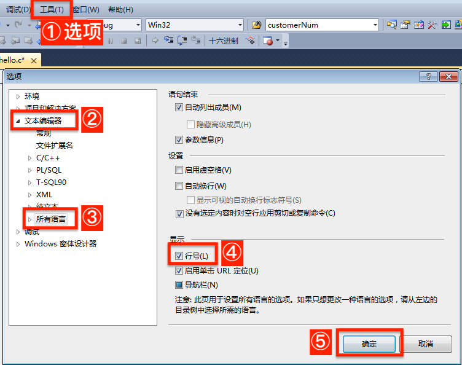

# 什么是IDE？

IDE。

# Microsoft Visual C++ 2010

1. 双击VC2010版安装软件（.exe），进入安装程序。（安装时需要联网）

2. 取消勾选”是，向Microsoft Corporation发送有关我的安装体验信息“前的对勾。下一步。

   

3. 许可条款：选择”我已阅读并接受许可条款“。下一步。

4. 安装选项：全部取消勾选。（我们不下载任何额外的软件）

5. 安装路径：

   

   * 默认存放在了C盘，为了不占用系统核心空间，**请选择一个D盘文件夹**进行存放。
     * 完全不会操作的同学可以参考以下步骤：

       1. 打开D盘 → 右键 → 新建文件夹  → 重命名文件夹为“Microsoft Visual C++ 2010”

       2. 把文件路径（D:\Microsoft Visual C++ 2010）复制到上面的白框中。
      * 点击安装。

6. 安装成功，退出。

### 一、新建项目

VC2010对源代码的管理是**基于项目**的，所以我们必须要学习如何创建一个新项目，从而使得我们写的C程序可以被编译执行。

下面是新建一个项目的具体步骤：


1. 文件 → 新建 → 项目

2. 选择”空项目“

3. 修改项目名称，如 MyProject01

4. 修改项目存放的位置（即文件路径）。

   * 最好选择D盘：在D盘新建一个文件夹，命名为“C Projects”，以后所有C程序相关的项目都可以放在这个文件夹内统一管理。

   * ”位置“填写：D:\C Projects\

5. 确定。

### 二、新建C文件

1. 右键点击”MyProject01“下的”源文件“文件夹 → 添加 → 新建项

   

2. 选择”C++文件“，名称改为`hello.c`，添加。

   

   * 如果名称只输入`hello`，编辑器会为我们生成一个`hello.cpp`的C++文件。
   * 不论选择生成C文件还是C++文件，在我们的程序练习范围内，这两个文件都可执行，没有影响。

### 三、编辑源文件

这里我们尝试写入一个简单的C程序：

```c
#include <stdio.h>
void main(){
  printf("Hello, Lvliang University!");
  getchar();
}
```

* 编辑完成之后，点击保存（每一次修改源文件后都要保存，才能使之生效）。

### 四、编译和运行程序

> 所有的C源文件都要经过以下三个步骤才能执行：
>
> * 预编译：替换头文件内容，并把注释部分去掉。（底层执行，我们并不会看到它在工作）
> * 编译：将`.c`文件编译成`.obj`文件。（VC6.0需要我们手动点击编译，VC2010则不需要）
> * 链接：将`.obj`文件与C语言的库文件链接，生成`.exe`文件（可执行文件）。（底层执行，我们并不会看到它在工作）
> * 此时双击`.exe`文件，便可以看到程序的输出结果。
>
> 在VC6.0中，我们需要先点击”编译“，再点击”执行“，然后才可以看到我们的程序输出结果。
>
> 在VC2010中，我们只需要点击”启动调试“，系统会替我们做完所有前置工作，我们就可以看到程序的输出结果。

1.  源文件编辑完成，并点击保存。

2. 点击”调试“，选择”启动调试“，系统就会自动完成从编译到执行的全部动作，你将在控制台中看到你输出的结果：


* 注意，在每一次重新启动调试的时候，都要关闭之前的控制台窗口，才能成功启动下一次程序调试。

### 五、修改VC2010系统设置

#### 5.1 修改默认字号大小

系统默认的字号为10。如果我们想修改其大小，请执行以下步骤：


1. 工具 → 选项。
2. （环境）→ 字体和颜色。
3. 大小（选择你认为合适的字号大小值，比如14）。
4. 并建议勾选”粗体“。
5. 确定。

#### 5.2 添加”启动调试“的快捷按钮

可以在程序头部菜单栏处增加一个”启动调试“的快捷按钮。步骤如下：


此时你将会看到程序左上角多了一个按钮，在每次编辑和保存源文件之后，只需要点击这个按钮就可以执行程序了。


#### 5.3 显示行号

1. （工具）→ 选项。
2. （文本编辑器）→  所有语言 → 勾选”行号“ → 确定。



#### 5.4 注释快捷键设置

1. （工具）→ 选项。
2. （环境）→ 键盘。
3. 在”显示命令包含“下的输入框中输入：注释。
   * 此时你会看到两个命令：编辑.取消注释选定内容 和 编辑.注释选定内容。
4. 选中”编辑.注释选定内容“。
5. 点击”按快捷键“下方的输入框空白处 → 在键盘上同时按下`Ctrl`和`/`，此时输入框内会展示你输入的组合键`Ctrl+/`。
6. 点击分配。
7. 选中”编辑.取消注释选定内容“。
8. 点击”按快捷键“下方的输入框空白处 → 在键盘上同时按下`Ctrl`和`\`，此时输入框内会展示你输入的组合键`Ctrl+\`。
9. 点击分配。
10. 确定。


这样设置过后，我们在编辑源文件时，就可以使用`Ctrl+/`和`Ctrl+\`方便地批量添加注释和取消注释。

#  Microsoft Visual C++ 6.0（VC6.0）

1. 双击VC6.0安装软件（.exe），进入安装程序。
2. 下一步。下一步。
3. 选择安装的文件夹：[↑请参考VC2010的安装路径](#一、安装)。
  * 注意把新建文件夹重命名为“Microsoft Visual Studio 6.0”。
4. 完成。

### 一、新建C程序

0. VC6.0支持单个源文件的编译和链接，所以如果你只希望简单快速地测试程序执行结果，并不打算模块化管理整个程序，那么你可以直接跳到下一节（[↓新建C文件](#二、新建C文件)）开始。

1. 双击桌面的"Visual C++ 6.0"打开程序。

2. 

3. 选择”一个空项目(E)“ → 完成。
4. 确定。

### 二、新建C文件

1. 
   * 注意：你输入的文件名如果自带`.c`后缀（如`hello.c`，那么程序会为你新建一个C文件。而如果你只输入的文件名没有带后缀（如`hello`），那么程序默认会为你新建一个以`.cpp`为后缀的C++文件。
   * 在我们的课程范围内，我们所写的程序在C++和C文件上都可以执行，所以不必纠结。

2. 

### 三、编辑源文件

这里我们尝试写入一个简单的C程序：

```c
#include <stdio.h>
void main(){
  printf("Hello, Lvliang University!");
}
```

* 编辑完成之后，点击保存（每一次修改源文件后都要保存，才能使之生效）。

### 四、编译和运行程序

> 所有的C源文件都要经过以下三个步骤才能执行：
>
> * 预编译：替换头文件内容，并把注释部分去掉。（底层执行，我们并不会看到它在工作）
> * 编译：将`.c`文件编译成`.obj`文件。（VC6.0需要我们手动点击编译，VC2010则不需要）
> * 链接：将`.obj`文件与C语言的库文件链接，生成`.exe`文件（可执行文件）。（底层执行，我们并不会看到它在工作）
> * 此时双击`.exe`文件，便可以看到程序的输出结果。
>
> 在VC6.0中，我们需要先点击”编译“，再点击”执行“，然后才可以看到我们的程序输出结果。
>
> 在VC2010中，我们只需要点击”启动调试“，系统会替我们做完所有前置工作，我们就可以看到程序的输出结果。

1. 源文件编辑完成，并点击保存。
2. （组建）编译 → 执行。


3. 编译和执行过后，我们就会看到程序中所定义的输出内容：


* 注意：`Press any key to continue` 并不是程序指定的输出，而是编辑器自动加上的一行信息。此时你可以按任意键退出输出窗口。

> 如果编译运行不能进行，可能是兼容性问题。因为VC6.0原生是设计给XP系统用的，如果你的电脑是Win7/Win8/Win10系统，那么需要解决兼容问题。
>
> 处理方法：
>
> 1. 回到桌面，右键点击VC 6.0的快捷图标，点击属性。
>
> 2. 选择”兼容性“标签，将兼容模式改为”Windows XP (Service Pack 3)“。
>
>    

